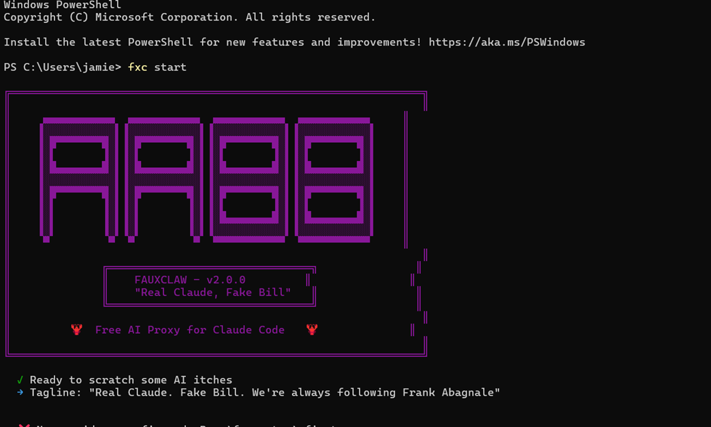

# 🦞 FAUXCLAW
```
> *Real Claude. Fake Bill.*  
> A free AI proxy for Claude Code that scratches your AI itch without scratching your wallet.

<p align="center">
  <a href="https://www.npmjs.com/package/fauxclaw">
    
  </a>
  <a href="https://www.npmjs.com/package/fauxclaw">
    
  </a>
  <a href="https://github.com/fauxclaw/fauxclaw/blob/main/LICENSE">
    
  </a>
  <a href="https://nodejs.org/">
    
  </a>
</p>

Fauxclaw routes Claude Code requests through multiple **free** providers – AWS CodeWhisperer (Kiro), OpenRouter free tier, and iFlow – with automatic failover, token refresh, and zero configuration beyond the initial setup.

**No credit card. No AWS bill. Just Claude.**

---

## Table of Contents

- [Quick Start](#quick-start)
- [What You Get](#what-you-get)
- [Commands](#commands)
- [Configuration](#configuration)
- [How It Works](#how-it-works)
- [FAQ](#faq)
- [Contributing](#contributing)
- [License](#license)

---

## Quick Start

### One-liner (install, setup, and start)

npm install -g fauxclaw && fxc setup && fxc start
Or step by step
bash
# Install globally
npm install -g fauxclaw

# Setup providers (Kiro OAuth, API keys)
fxc setup

# Start the proxy
fxc start
Then point Claude Code (or any Anthropic‑compatible client) to:

export ANTHROPIC_BASE_URL=http://localhost:8083
export ANTHROPIC_API_KEY=anything   # or your FXC_API_KEY if you set one
claude
That's it. Claude Code now works for free.

What You Get
Provider	Models	Cost	Auto Refresh
Kiro (AWS CodeWhisperer)	Claude Sonnet 4.5, Claude Haiku	Free (AWS Builder ID)	✅ Yes
OpenRouter	Claude 3.5 Haiku, GPT-4o mini, DeepSeek R1	Free tier	❌ Static key
iFlow	DeepSeek R1, Qwen, Llama, Mixtral	Free (token)	❌ Static token
Fallback chain: Kiro → OpenRouter → iFlow

If one provider fails, rate-limits you, or your token expires, Fauxclaw automatically tries the next one. You won't even notice.

Commands
fxc setup          # Interactive provider setup (Kiro device auth, API keys)
fxc start          # Launch the proxy (default command)
fxc status         # Show token expiry & provider health
fxc metrics        # Request latency, success rates, provider breakdown
fxc purge          # Delete expired conversation sessions
fxc help           # Display this help information
All commands are designed to be intuitive. Run fxc setup once, then fxc start forever.

Configuration
Environment Variables
Optional – most things are stored in ~/.fauxclaw/config.json after setup.

FXC_PORT=8083                     # Port to listen on
FXC_HOST=127.0.0.1                # Bind address (use 0.0.0.0 for external access)
FXC_API_KEY=your-secret-here      # Require this in X-Proxy-Key header
FXC_RATE_LIMIT=100                # Requests per minute per IP
FXC_LOG=info                      # debug | info | warn | error
FXC_TIMEOUT=30000                 # Request timeout in milliseconds
FXC_MAX_BUFFER=5242880            # Max buffer size for streaming (5MB)
Config File Location
All tokens, OAuth secrets, and API keys are stored in:

~/.fauxclaw/config.json
Permissions are set to 0600 (owner read/write only) because it contains sensitive data.

How It Works
Claude Code sends a request to http://localhost:8083/v1/messages

Fauxclaw tries providers in order:

Kiro – Uses AWS Builder ID OAuth device flow. Tokens refresh automatically every hour.

OpenRouter – Forwards to :free models. Requires a free API key.

iFlow – Adds HMAC signature and session headers. Requires a free token.

If streaming (Claude Code streams by default), Fauxclaw translates:

Kiro's binary AWS EventStream → Anthropic SSE

OpenRouter/iFlow SSE → pass through unchanged

If a provider fails, the circuit breaker opens for 60 seconds to avoid hammering it.

Your Claude session continues like nothing happened.

FAQ
Is this legal?
Yes. You're using AWS CodeWhisperer's free tier exactly as AWS intended – with your own AWS Builder ID. Fauxclaw is just a translation layer. No AWS ToS violation. No credit card required. No "hacks".

Do I need an AWS account?
Yes, a free one. You'll authenticate once via https://view.awsapps.com/start during fxc setup. No billing info required.

Can I use this in production?
Please don't. This is a weekend project held together by reverse‑engineered API calls and hope. But if you really want to:

Enable FXC_API_KEY for authentication

Bind to 127.0.0.1 (default) or put it behind a VPN

Add a reverse proxy with HTTPS (Caddy is free)

Monitor the logs – things will break

How long do Kiro tokens last?
About 1 hour. But Fauxclaw automatically refreshes them in the background. You'll never see an expiry error.

Why "Fauxclaw"?
Because it's a fake (faux) Claw (Claude/Claw Code) – and lobsters have claws. Also, "Fauxclaw" sounds like "faux claw", which is what you use when you don't have real claws. I'm not good at naming things, but here we are.

Does this work with other Anthropic clients?
Yes. Any client that speaks the Anthropic Messages API (Claude Code, LibreChat, TypingMind, custom scripts) will work. Just point them to http://localhost:8083.

Contributing
See BUILDME.md for:

Development setup (Node.js 18+)

Project structure (where everything lives)

Adding a new provider (step by step)

Debugging tips (binary frame hell)

Testing manually (curl commands)

Pull request guidelines

Short version: Keep it dependency‑free. No TypeScript. No build step. Test your changes.

License
Mozilla Public License 2.0 (MPL-2.0)

This Source Code Form is subject to the terms of the Mozilla Public License, v. 2.0. If a copy of the MPL was not distributed with this file, You can obtain one at https://mozilla.org/MPL/2.0/.

What this means for you:

✅ Use Fauxclaw for anything – personal, commercial, internal

✅ Modify it – but share your changes to the Fauxclaw codebase

✅ Include it in proprietary software – as long as you don't modify Fauxclaw itself

✅ Sell a service powered by Fauxclaw – no problem

❌ Close-source your modifications to Fauxclaw – share them back

See the full license text for details.

🦞 Credits
Fauxclaw stands on the shoulders of reverse‑engineered giants:

free-claude-code – Proxy architecture, model routing

9router – Kiro executor, token refresh

claudecodeui – Session management patterns

And a lot of staring at binary EventStream dumps at 3:42 AM CST/CDT.

npm install -g fauxclaw && fxc setup && fxc start
"Fake it till you make it, but today you made it." 🦞


<div align="center">
  
  <br>
  <em>Fauxclaw running in PowerShell</em>
</div>
